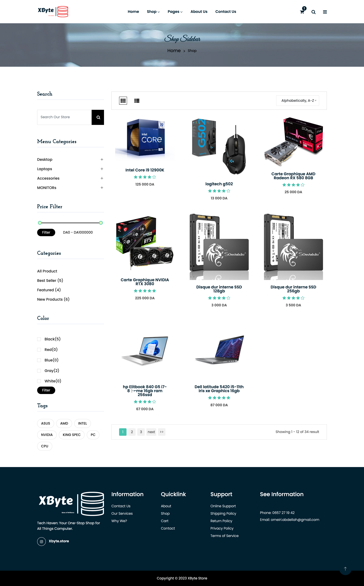
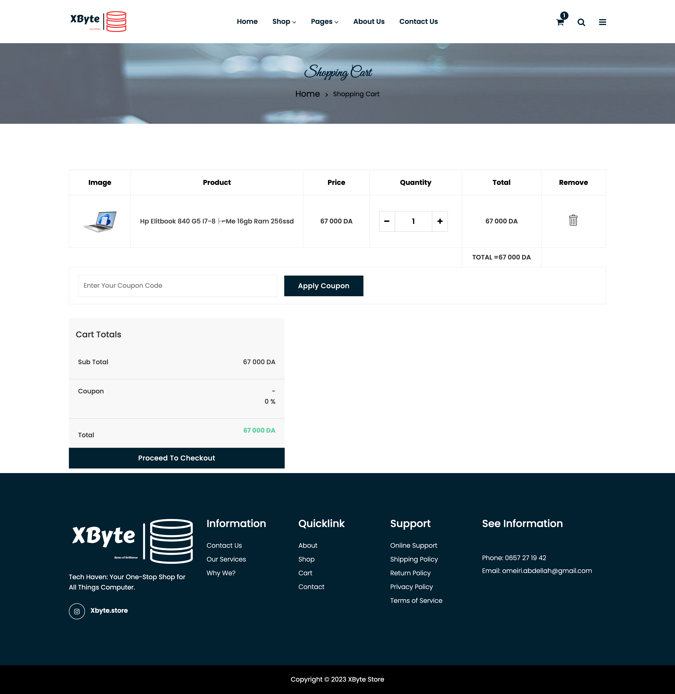
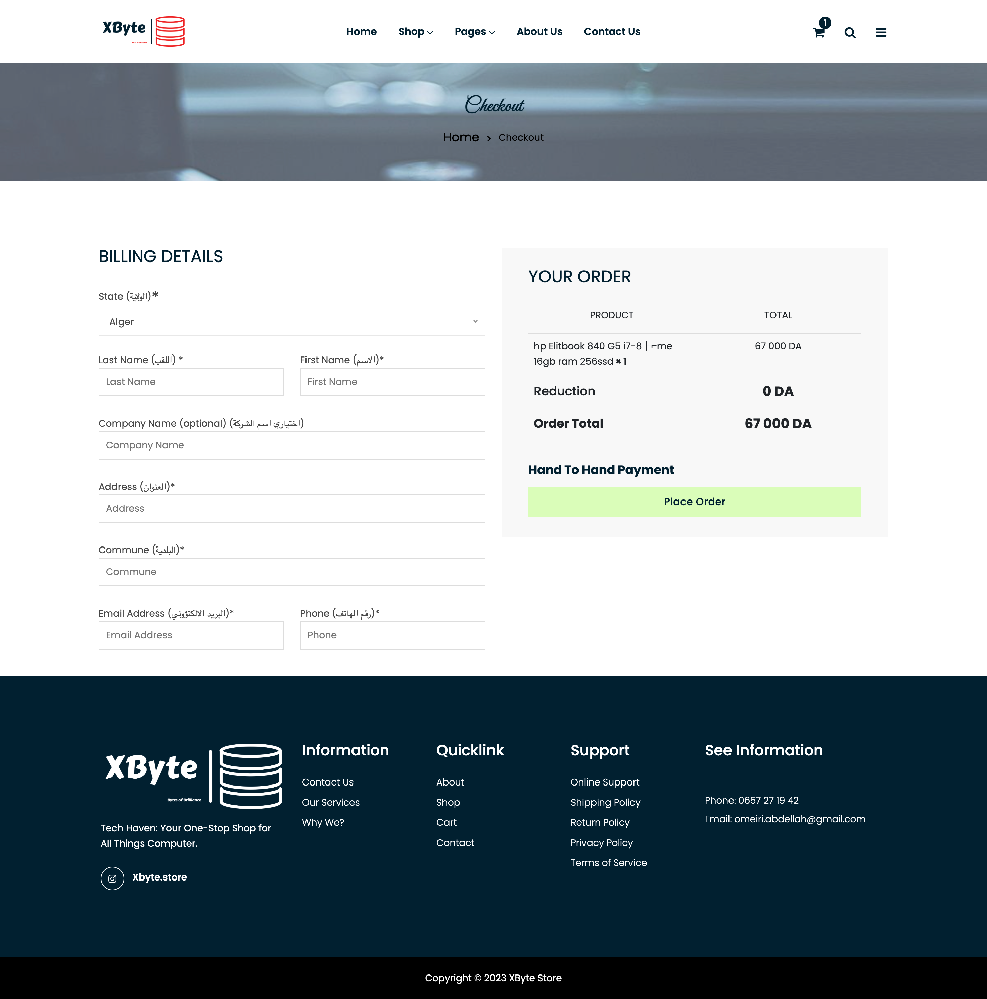
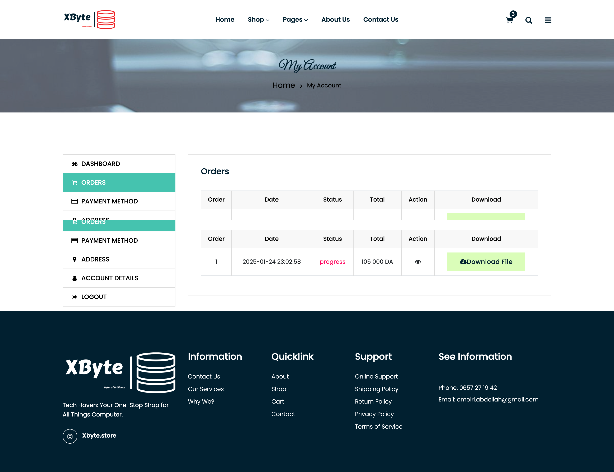
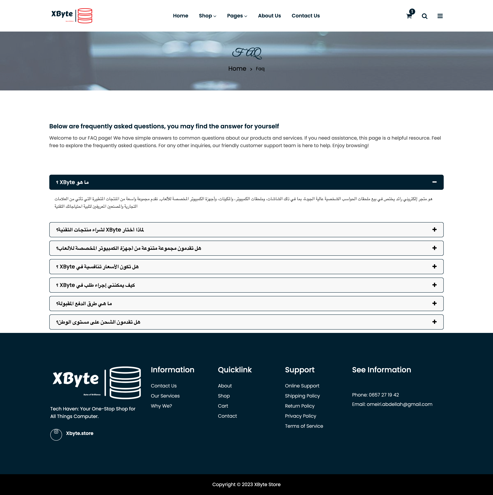

# XByte E-Commerce Website

XByte is a **pure PHP-based e-commerce platform** designed to provide a seamless and user-friendly shopping experience. The website specializes in offering a wide range of computer-related products, including desktops, laptops, accessories, and more. This README provides an overview of the project, its features, and instructions for setting it up.

---

## ✨ Features

### 🔐 **User Authentication**
- Users can create accounts, log in, and manage their profiles.
- Secure password handling for user safety.

### 🛒 **Product Catalog**
- Browse and search for products by **category**, **price**, and **tags**.
- Dynamic product listings with filters for easy navigation.

### 🛍️ **Shopping Cart**
- Add and remove products from the cart.
- Apply **coupon codes** for discounts.

### 💳 **Checkout**
- Secure checkout process with **billing details**.
- Multiple payment options for flexibility.

### 📦 **Order Management**
- View **order history** and track order status.
- Download **order details** and invoices.

### ❓ **FAQ Section**
- Frequently asked questions to assist users with common queries.
- Easy-to-navigate help section for quick support.

### 📱 **Responsive Design**
- Fully responsive design for seamless access on **desktop**, **tablet**, and **mobile devices**.
- Optimized for a smooth user experience across all platforms.

---

## 🖼️ Screenshots

Here are some screenshots of the main pages:

### Home Page

### Shop Page

### Shopping Cart

### Checkout Page

### My Account

### Orders

### FAQ Page

---

## 🛠️ Tech Stack

- **PHP**: Core backend development.
- **MySQL**: Database management for storing products, users, and orders.
- **HTML5 & CSS3**: Frontend structure and styling.
- **JavaScript**: Interactive elements and dynamic content.
- **Bootstrap**: Responsive design framework for a modern UI.

---

## 🚀 Quick Setup

### Prerequisites
- **PHP 7.4+**
- **MySQL 5.7+**
- **Web Server** (Apache/Nginx)

## 📞 Contact & Support

- 📧 **Email**: [omeiri.abdellah@gmail.com](mailto:omeiri.abdellah@gmail.com)
- 🐞 **Issue Tracker**: [GitHub Issues](https://github.com/Mromeiri/XByte-store/issues)

## 🙏 Acknowledgments

- **Bootstrap Team** for the responsive grid system
- **PHP Community** for continuous language evolution
- **Open Source Contributors** who inspire innovation

---

**Made with ❤️ by OMEIRI Abdellah**
