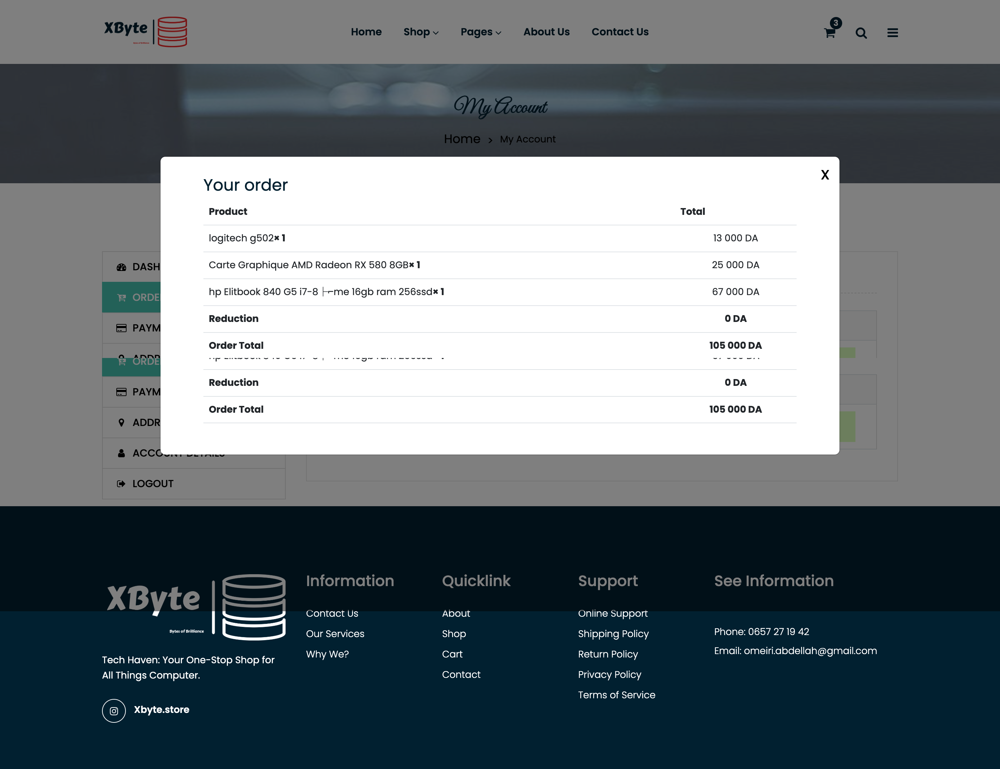

# 🖥️ Xbyte - Modern E-Commerce Platform

## 🌟 Project Overview

**Xbyte** is a cutting-edge e-commerce website developed with **pure PHP**, designed to provide an exceptional online shopping experience. With a focus on user-friendly design and robust functionality, Xbyte offers a seamless platform for customers to explore, select, and purchase a wide range of products.

## 🚀 Key Features

### 💻 Intuitive User Experience
- **Responsive Design**: Fully optimized for desktop and mobile devices
- **Clean, Modern Interface**: Sleek and professional design that enhances user engagement
- **Smooth Navigation**: Intuitive menu system with advanced filtering options

### 🛍️ Comprehensive Shopping Experience
- **Extensive Product Catalog**
  - Categories spanning PCs, accessories, and more
  - Dynamic product showcases
  - Best sellers and new arrival highlights

### 🔒 Secure & Flexible Checkout
- **Flexible Authentication**
  - Guest checkout option
  - Registered user accounts
- **Secure Payment Integration**
  - Multiple payment gateway support
  - Encrypted transaction processing

### 👤 User Account Management
- Profile customization
- Order history tracking
- Invoice management

### 🖥️ Powerful Admin Controls
- Product management
- Order tracking
- User account administration

## 🖼️ Screenshots

Here are some screenshots of **Xbyte** in action:

### Homepage

### Shop Screen

### Checkout Page

### Cart Screen

### Account Page

### Orders

### Faq

## 🛠 Tech Stack

| Technology | Purpose |
|-----------|---------|
| **PHP** | Core Backend Development |
| **MySQL** | Database Management |
| **HTML5** | Structural Markup |
| **CSS3** | Styling |
| **JavaScript** | Interactive Elements |
| **AJAX** | Dynamic Content Loading |
| **Bootstrap 4** | Responsive Design Framework |

## 🔧 Quick Setup

### Prerequisites
- PHP 7.4+
- MySQL 5.7+
- Web Server (Apache/Nginx)

## 📞 Contact & Support

- 📧 **Email**: [omeiri.abdellah@gmail.com](mailto:omeiri.abdellah@gmail.com)
- 🐞 **Issue Tracker**: [GitHub Issues](https://github.com/Mromeiri/XByte-store/issues)

## 🙏 Acknowledgments

- **Bootstrap Team** for the responsive grid system
- **PHP Community** for continuous language evolution
- **Open Source Contributors** who inspire innovation

---

**Made with ❤️ by OMEIRI Abdellah**
